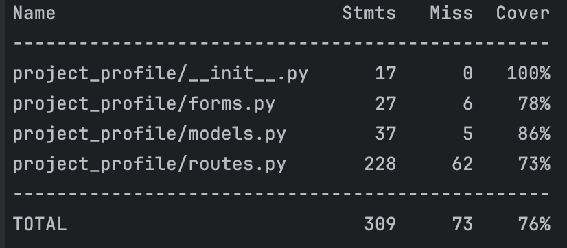

# sQuizMe

sQuizMe is a web application designed to help users create and manage quizzes. It provides a platform where users can create quizzes on various topics, generate quiz questions using AI (Artificial Intelligence), and share their quizzes with others.

### Key features:

	•	Quiz creation: Users can create quizzes by entering a quiz name, description, and specifying the number of questions.
	•	AI-Powered question generation: The application uses AI (specifically OpenAI’s GPT-3.5 model) to automatically generate quiz questions based on provided text.
	•	Quiz management: Users can view, edit, rename, and delete quizzes they have created.
	•	Quiz taking: Registered users can take quizzes, receive immediate feedback on their answers, and view their quiz results.
	•	Community quizzes: Users can share their quizzes publicly, allowing others (including non-registered users) to access and take the quizzes.
	•	User authentication: The application requires users to register and log in to create, manage, or take quizzes.

### Technologies used:

- **Flask**: Micro web framework for Python.
- **Flask-Bcrypt**: For hashing passwords.
- **Flask-SQLAlchemy**: For database management.
- **Flask-Login**: For managing user sessions.
- **WTForms**: For creating and validating web forms.
- **OpenAI API**: For AI-powered question generation.
- **dotenv**: For managing environment variables.
- **HTML/CSS/JavaScript**: For the front-end.

### How to use:

1. **Clone the repository**:
    ```sh
    git clone https://github.com/KrasAlena/sQuizMe.git
    cd sQuizMe
    ```

2. **Create and activate a virtual environment**:
    ```sh
    python -m venv venv
    source venv/bin/activate  # On Windows use `venv\Scripts\activate`
    ```

3. **Install the dependencies**:
    ```sh
    pip install -r requirements.txt
    ```

4. **Set up environment variables**:
    Create a `.env` file in the root directory of the project and add the following variables:
    ```
    OPENAI_API_KEY=your_openai_api_key
    ```

5. **Initialize the database**:
    ```sh
    flask db init
    flask db migrate -m "Initial migration."
    flask db upgrade
    ```

6. **Run the application**:
    ```sh
    python run.py
    ```

7. **Access the application**:
    Open your web browser and go to `http://127.0.0.1:5000/`.

### Routes overview (from `routes.py`):

- **Index**: `/` - Home page.
- **Register**: `/register` - User registration.
- **Login**: `/login` - User login.
- **Logout**: `/logout` - User logout.
- **Create quiz**: `/create_quiz` - Create a new quiz.
- **My quizzes**: `/my_quizzes` - View user's quizzes.
- **Community quizzes**: `/community_quizzes` - View public quizzes.
- **Quiz**: `/quiz/<int:quiz_id>` - Take a quiz.
- **Rename quiz**: `/rename_quiz/<int:quiz_id>` - Rename a quiz.
- **Delete quiz**: `/delete_quiz/<int:quiz_id>` - Delete a quiz.
- **Share quiz**: `/share_quiz/<int:quiz_id>` - Share a quiz publicly.

### JavaScript:

The application includes some JavaScript to enhance the user experience. Examples of this can be found in `base.html` and `my_quizzes.html`.

#### JavaScript in `base.html`:
THere, the alerts are hidden after 3 seconds and a loader is displayed during form submission.
```javascript
document.addEventListener('DOMContentLoaded', function() {
    const form = document.getElementById('create-quiz-form');
    const loadingIndicator = document.getElementById('loading-indicator');
    const generateBtn = document.getElementById('generate-btn');

    form.addEventListener('submit', function() {
        loadingIndicator.style.display = 'block';
        generateBtn.disabled = true; // Disable the generate button during loading
    });
});

document.addEventListener('DOMContentLoaded', function() {
    const alerts = document.querySelectorAll('.alert');

    alerts.forEach(function(alert) {
        setTimeout(function() {
            alert.style.display = 'none';
        }, 3000); // 3000 milliseconds = 3 seconds
    });
});
```
#### JavaScript in `my_quizzes.html`:
```javascript
document.addEventListener('DOMContentLoaded', function() {
    const renameBtns = document.querySelectorAll('.rename-btn');
    renameBtns.forEach(btn => {
        btn.addEventListener('click', function() {
            const parentLi = this.parentElement.parentElement;
            const renameForm = parentLi.querySelector('.rename-form');
            renameForm.style.display = 'flex';
            this.style.display = 'none';
    });
  });

    const cancelBtns = document.querySelectorAll('.cancel-btn');
    cancelBtns.forEach(btn => {
        btn.addEventListener('click', function(e) {
            e.preventDefault();
            const renameForm = this.closest('.rename-form');
            const renameBtn = renameForm.parentElement.querySelector('.rename-btn');
            renameForm.style.display = 'none';
            renameBtn.style.display = 'block';
    });
  });
});
```
This script allows users to rename quizzes inline and cancel the renaming process.
## Testing

### Overview
I have implemented a suite of tests that cover main functionalities and scenarios within the project. These tests validate both individual components and the integrated system to maintain consistent behavior and performance.

### Test Structure
My test suite is organized into `test_routes.py` file under the `tests/` directory.

### Testing Frameworks and Tools
I use [pytest](https://pytest.org/) as our primary testing framework due to its simplicity, flexibility, and powerful features for writing and executing tests. 
### Coverage


### Running Tests
To run the tests locally, follow these steps:
1. Ensure all dependencies are installed by running `pip install -r requirements.txt`.
2. Execute `pytest` in the root directory of the project.
3. Monitor the test output to ensure all tests pass successfully.
4. Review the coverage report (`coverage report`) to gauge test coverage adequacy.

